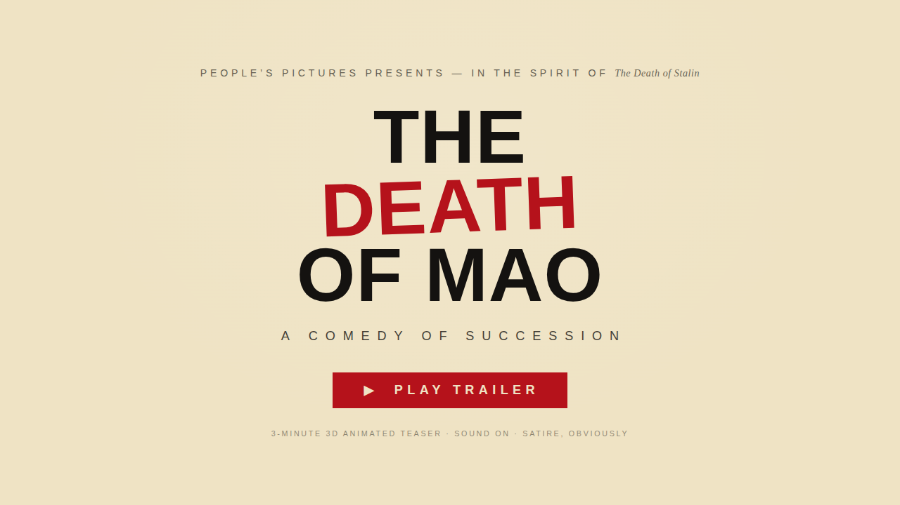
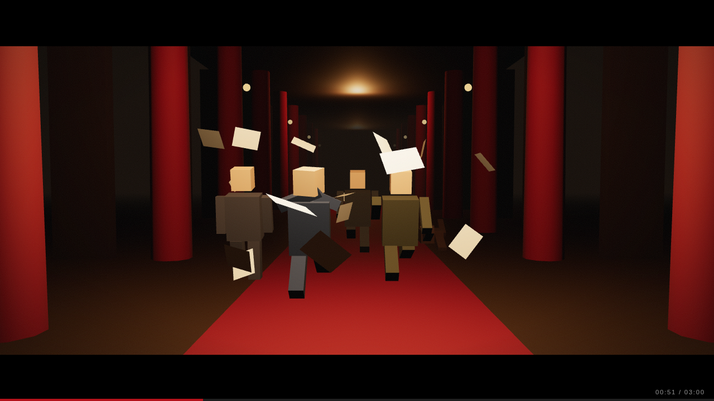
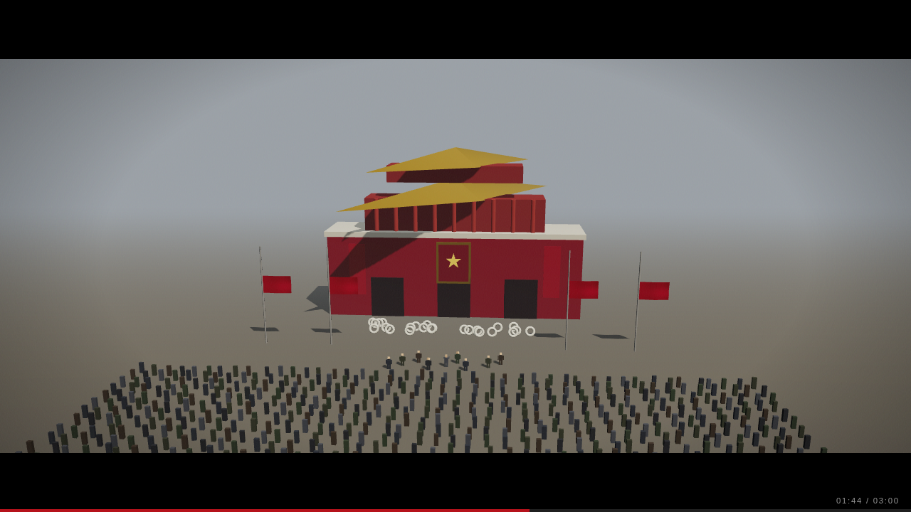
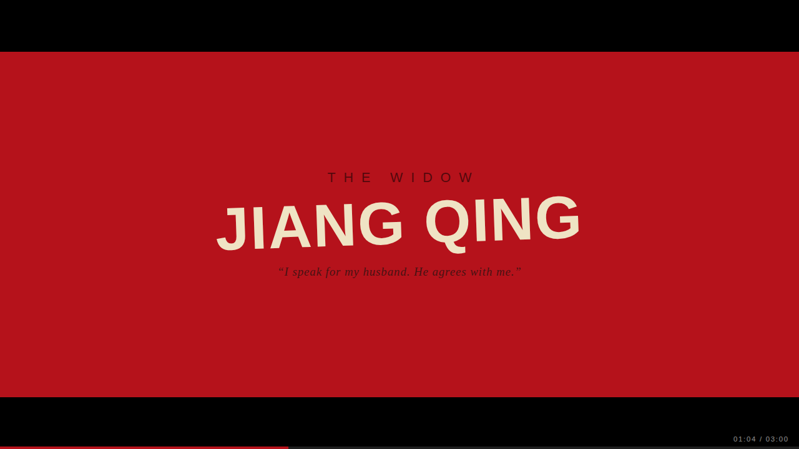
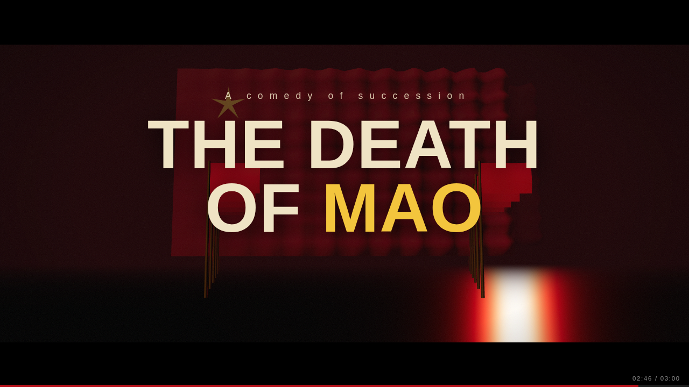

# THE DEATH OF MAO — Official Teaser Trailer

> *A comedy of succession.* Nobody is in charge. Everybody is in trouble.

A 3-minute, fully 3D animated teaser trailer in the satirical spirit of
**The Death of Stalin** (2017) — same gallows-comedy register, same
red/cream/black constructivist title cards, pointed at a different
politburo. September 1976: the Chairman is dead, which is officially a
problem, because nobody wants to be the one to announce it.

Everything is rendered **live in the browser**: no video file, no build
step, no external assets beyond two Google Fonts. Three.js is vendored.



## The production

| | |
|---|---|
|  |  |
|  |  |

- **Eight 3D sets** — the Zhongnanhai compound at night, the Chairman's
  study (doctors chosen for loyalty, not medicine), a corridor sprint,
  the politburo meeting room, the Square in mourning, a nocturnal
  arrest conducted at a brisk jog, one very lonely desk, and a finale
  of wind-simulated flags.
- **A scripted 180-second edit** — 18 camera-animated shots cut against
  26 title cards, including a *Death of Stalin*-style cast sequence
  (The Widow, The Successor, The Marshal, The Exile, …and the Gang of
  Four — they counted themselves).
- **A procedural orchestral score** — ~3,000 notes of pseudo-Shostakovich
  (drones, gallops, timpani rolls, a state-funeral choir, one comedic
  silence) composed in code and scheduled sample-accurately through
  WebAudio. Visuals are clocked off the audio context, so picture and
  music cannot drift.
- **Cinematic dressing** — 2.39:1 letterbox, animated film grain,
  vignette, ACES tone mapping, a breath of handheld camera.

## Also in here: *Track One* — a US–China AI diplomacy game

Served at **`/game`** (a self-contained second page; the trailer is untouched).

> *Who should the U.S. talk to in China on AI?* You are the U.S. delegation
> at the first U.S.–China AI dialogue. Staff six negotiation tracks with the
> right Chinese counterparts, survive the talks, and bring home a communiqué.

A playable gloss on Matt Sheehan's essay — both of its open questions: *who*
to talk to, and *what* to talk about. Four phases:
**who's in the room?** (you don't pick China's delegation — Beijing fields its
comfortable, face-saving default, and you spend limited *leverage* to pull the
real power-holders into the room; the powerful, closed orgs cost the most),
**set the agenda** (table 3 of 7 items drawn from the essay — testing
best-practices is its explicit lean, binding-verification its warned-against
trap; Beijing's appetite and the room you built decide what lands), **the
negotiation** (each tabled item plays as a *live two-beat exchange* — the
seated counterpart opens in character, you answer line by line — interleaved
with event cards the system throws at you anyway; four meters: Trust,
Progress, U.S. Backing, China Buy-In), and **the readout** (a procedurally assembled joint statement, a diplomatic stamp, and
"six months on" epilogues earned by your specific choices). The scoring encodes
the essay's thesis — *progress only counts if someone powerful can deliver it* —
and the staffing phase encodes its caveat: *you don't get to choose your
counterparts; China does.*

Phase A ripples through Phase B mechanically: options unlock or strengthen
depending on who you pulled into the room ("Because TC260 is in the room…"),
some events only fire for certain delegations (cheap out on the lead and
Beijing reopens the question mid-talks), and a few choices *reseat the table*
for the rest of the run. One "consult the China hands" per run reveals the
forecast behind each option. A–D / 1–4 and Enter play it from the keyboard.

A second mode, **+5 Years: Read the Tells**, inverts the exercise: instead of
choosing counterparts, you're shown a reshuffled 2031 org chart and have to
*infer* what the bureaucratic shift implies about AI's real impact and how
Beijing is choosing to deal with it — treating the chart as a costly signal of
private belief. Two of the futures bake in a triangulation discipline (an
ambiguous tell that only resolves against a second signal). You're scored on
read accuracy and rated as an analyst.

Same no-build stack: vanilla JS modules, the constructivist red/blue/parchment
title-card look, an ambient three.js globe, and a tiny procedural WebAudio
score. All content is drawn from — and was fact-checked against — the essay.

## Running it

Any static file server works:

```sh
npx serve .        # or: python3 -m http.server
```

Open the page, press **▶ PLAY TRAILER** (audio needs one click).

- `Space` pauses. Digits `1`–`9` seek to 10%–90%. The progress bar is clickable.
- `?t=95` starts at a given second; add `&mute=1` for silent autoplay (used for testing).

## Deploying

A GitHub Actions workflow (`.github/workflows/pages.yml`) deploys the
site to **GitHub Pages** on every push. It also works on Vercel as a
static site — `vercel deploy` from the repo root, or import the repo at
vercel.com; no configuration needed beyond the included `vercel.json`.

---

*This is a work of satire. All low-poly persons depicted are 14
centimetres tall and entirely fictional. No historical accuracy was
harmed in the making of this trailer — it was never consulted.*
